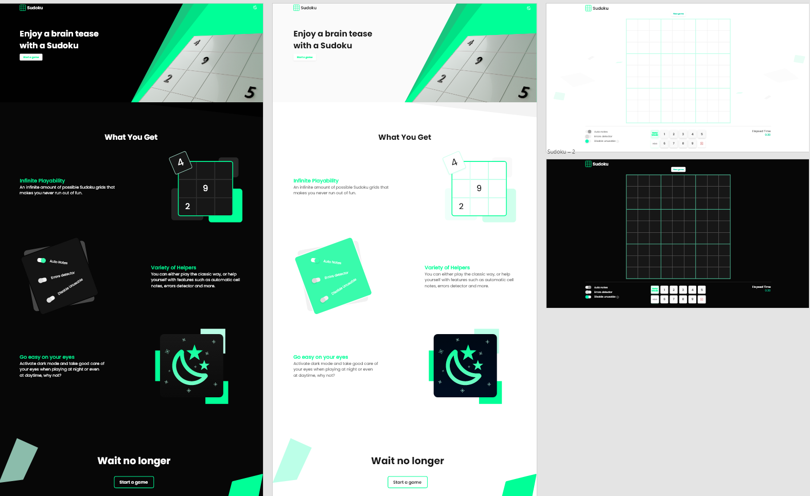

# React Sudoku

A Suduku game with some of the features that I have always thought lacking whenever I played it. The game uses an algorithm (which can be found in my [other repo](https://github.com/medchek/sudoku-generator-algorithm)) to pre-generate a fully filled and valid sudoku grid beforehand, making therefore every played game 100% solvable. The UI was written with React using typescript and designed using [Adobe XD](https://www.adobe.com/products/xd.html).

## Features

- Unlimited amount of sudoku grids.
- Ability to auto generate cell notes.
- Ability to highlight wrong solutions.
- Ability to disable numbers that cannot go in a cell.
- Keybinds.
- Dark mode.
- Responsive.

## Demo

You can access the app using this [link](https://react-sudoku-chmd.netlify.app/).

## License

The app is released under the [GPL-3.0 license](https://www.gnu.org/licenses/gpl-3.0.en.html)
